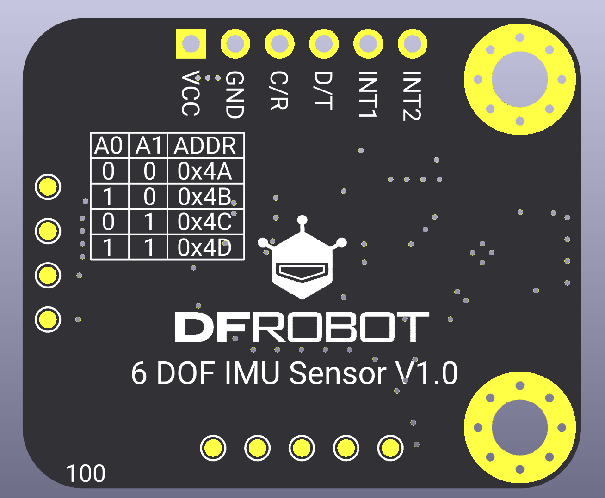
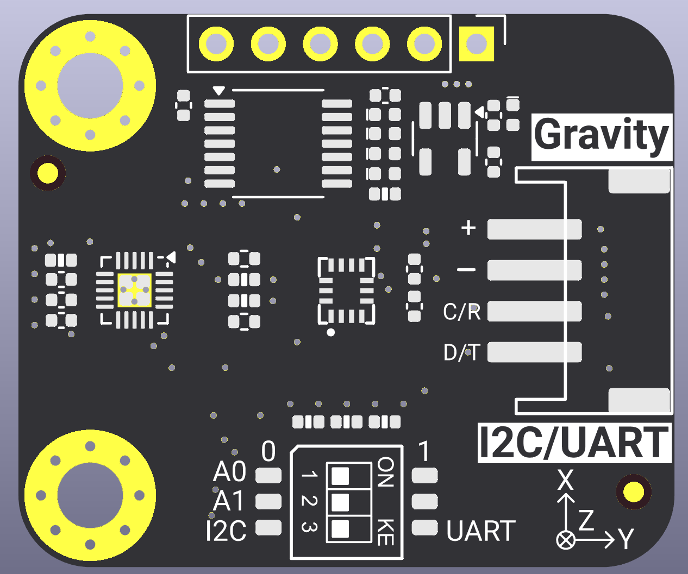
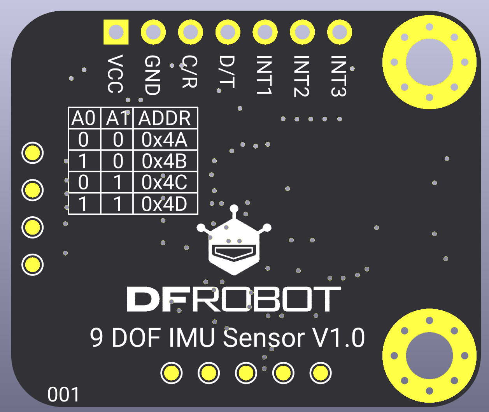
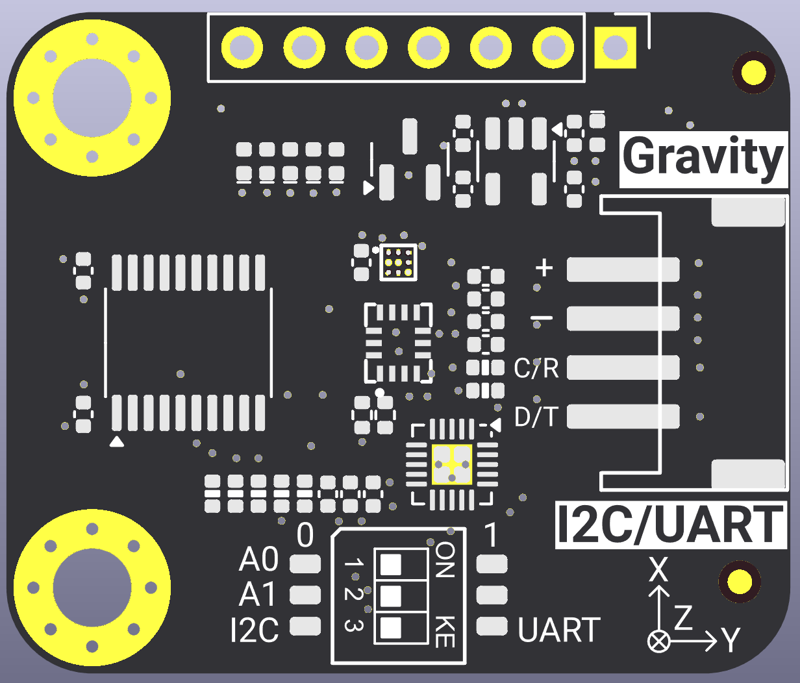
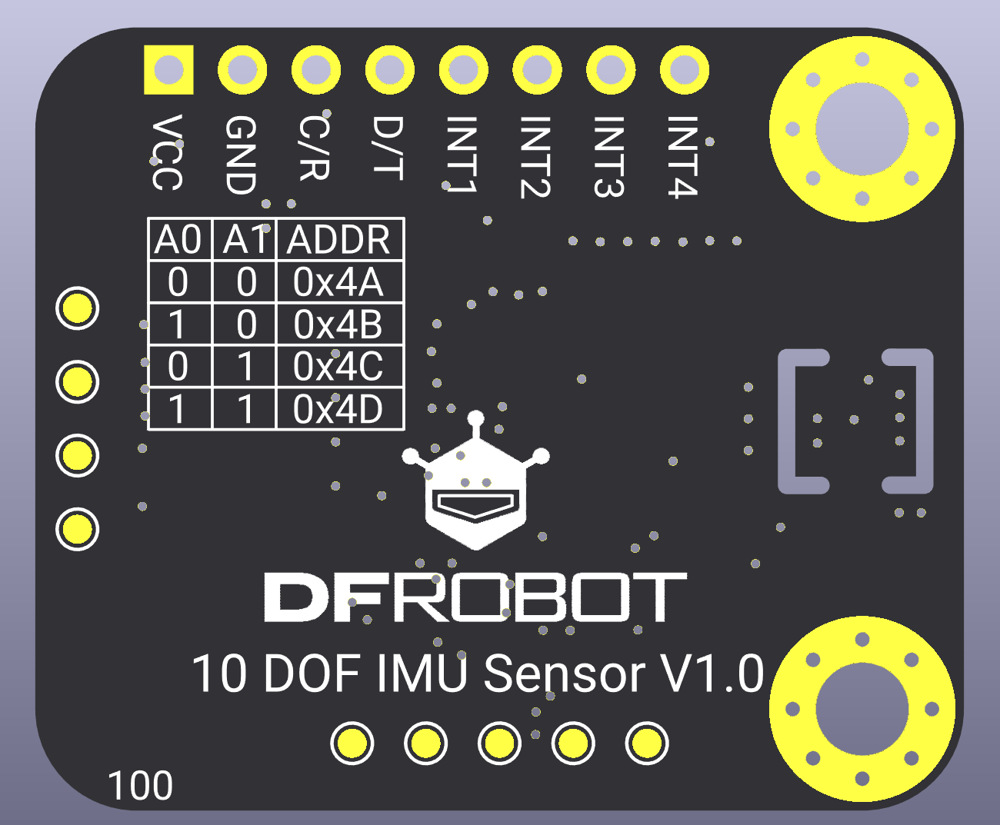
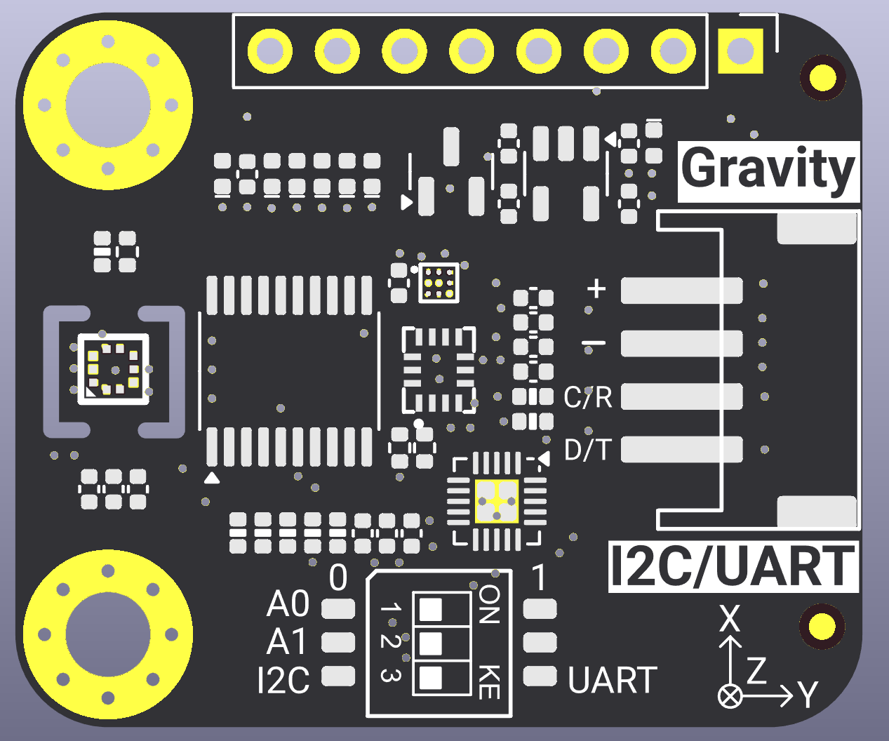

# DFRobot_Multi_DOF_IMU
- [Chinese Version](./README_CN.md)

DFRobot_Multi_DOF_IMU is a multi-DOF IMU sensor library that supports reading sensor data through I2C/UART interfaces. This library supports 6DOF (accelerometer + gyroscope), 9DOF (+ magnetometer), and 10DOF (+ barometer) sensors, providing comprehensive motion detection and attitude sensing capabilities.

This sensor is very suitable for wearable devices, smart watches, fitness trackers, drones, robot navigation, and IoT applications that require high performance in motion sensing, attitude detection, and energy efficiency. Through configurable interrupt pins (INT1, INT2, INT3, INT4), the sensor can efficiently notify the host system of various motion events, making it ideal for battery-powered applications.

**Key Features:**

- Multi-DOF motion sensing (6DOF/9DOF/10DOF)
- Supports both I2C and UART (Modbus RTU) communication interfaces
- Hardware step counter with interrupt support
- Multiple motion detection modes (any motion, no motion, significant motion)
- Gesture recognition (tap, tilt, orientation, flat detection)
- Barometric pressure detection and altitude calculation
- Pressure out-of-range (OOR) interrupt
- Multiple operating modes (sleep, low power, normal, high performance)
- Configurable accelerometer and gyroscope ranges
- Multiple interrupt pins for flexible event handling

### SEN0692

<p align="center">
  
  
</p>


### SEN0694

<p align="center">
  
  
</p>


### SEN0696

<p align="center">
  
  
</p>


## Product Link (https://www.dfrobot.com)

```
SKU: SEN0692/SEN0694/SEN0696
```

## Table of Contents

  * [Overview](#overview)
  * [Installation](#installation)
  * [Methods](#methods)
  * [Compatibility](#compatibility)
  * [History](#history)
  * [Credits](#credits)

## Overview

This Arduino library provides a comprehensive interface for multi-DOF IMU sensors. It supports:

**Basic Functions:**

- Initialize sensor through I2C or UART interface
- Configure sensor operating modes (sleep, low power, normal, high performance)
- Configure accelerometer and gyroscope ranges
- Read 6DOF sensor data (accelerometer + gyroscope)
- Read 9DOF sensor data (accelerometer + gyroscope + magnetometer)
- Read 10DOF sensor data (accelerometer + gyroscope + magnetometer + barometer)
- Pressure calibration (based on local altitude)
- Pressure out-of-range (OOR) detection configuration

**Advanced Functions:**

- Step counter with interrupt support
- Any motion detection interrupt
- No motion detection interrupt
- Significant motion detection interrupt
- Flat detection interrupt
- Orientation detection interrupt (portrait/landscape, face up/down)
- Tap detection interrupt (single/double/triple tap)
- Tilt detection interrupt
- Pressure data ready interrupt
- Pressure out-of-range interrupt

## Installation

To use this library, first download the library files, paste them into the \Arduino\libraries directory, then open the examples folder and run the example programs.

## Methods

```C++
  /**
   * @fn begin
   * @brief Initialize sensor
   * @return bool
   * @retval true  Initialization successful
   * @retval false Initialization failed
   */
  bool begin(void);

  /**
   * @fn setSensorMode
   * @brief Set sensor operating mode
   * @param mode Sensor operating mode (see eSensorMode_t)
   * @n Available modes:
   * @n - eSleepMode:           Sleep mode (lowest power consumption, sensor stops working)
   * @n - eLowPowerMode:        Low power mode (reduced sampling rate, saves power)
   * @n - eNormalMode:          Normal mode (balances power consumption and performance)
   * @n - eHighPerformanceMode: High performance mode (highest sampling rate and accuracy, highest power consumption)
   * @return bool
   * @retval true  Setting successful
   * @retval false Setting failed
   */
  bool setSensorMode(eSensorMode_t mode);

  /**
   * @fn reset
   * @brief Restore factory settings
   * @return bool
   * @retval true  Factory reset successful
   * @retval false Factory reset failed
   */
  bool reset(void);

  /**
   * @fn setAccelRange
   * @brief Set accelerometer range
   * @param range Accelerometer range (see eAccelRange_t)
   * @n Available ranges:
   * @n - eAccelRange2G:  ±2g range
   * @n - eAccelRange4G:  ±4g range
   * @n - eAccelRange8G:  ±8g range
   * @n - eAccelRange16G: ±16g range
   * @return bool
   * @retval true  Setting successful
   * @retval false Setting failed
   */
  bool setAccelRange(eAccelRange_t range);

  /**
   * @fn setGyroRange
   * @brief Set gyroscope range
   * @param range Gyroscope range (see eGyroRange_t)
   * @n Available ranges:
   * @n - eGyroRange125DPS:  ±125dps range
   * @n - eGyroRange250DPS:  ±250dps range
   * @n - eGyroRange500DPS:  ±500dps range
   * @n - eGyroRange1000DPS: ±1000dps range
   * @n - eGyroRange2000DPS: ±2000dps range
   * @return bool
   * @retval true  Setting successful
   * @retval false Setting failed
   */
  bool setGyroRange(eGyroRange_t range);

  /**
   * @fn get6dofData
   * @brief Read 6DOF IMU data (physical units)
   * @param accel Pointer to sSensorData_t structure for storing accelerometer data (unit: g)
   * @param gyro Pointer to sSensorData_t structure for storing gyroscope data (unit: dps)
   * @return bool
   * @retval true  Read successful
   * @retval false Read failed
   */
  bool get6dofData(sSensorData_t *accel, sSensorData_t *gyro);

  /**
   * @fn get9dofData
   * @brief Read 9DOF IMU data (physical units)
   * @param accel Pointer to sSensorData_t structure for storing accelerometer data (unit: g)
   * @param gyro Pointer to sSensorData_t structure for storing gyroscope data (unit: dps)
   * @param mag Pointer to sSensorData_t structure for storing magnetometer data (unit: uT)
   * @return bool
   * @retval true  Read successful
   * @retval false Read failed
   */
  bool get9dofData(sSensorData_t *accel, sSensorData_t *gyro, sSensorData_t *mag);

  /**
   * @fn get10dofData
   * @brief Read 10DOF IMU data (physical units)
   * @param accel Pointer to sSensorData_t structure for storing accelerometer data (unit: g)
   * @param gyro Pointer to sSensorData_t structure for storing gyroscope data (unit: dps)
   * @param mag Pointer to sSensorData_t structure for storing magnetometer data (unit: uT)
   * @param pressure Pointer to float for storing pressure or altitude data
   * @param calcAltitude Whether to calculate altitude, default is false
   * @n true: pressure stores altitude (unit: m)
   * @n false: pressure stores pressure data (unit: Pa)
   * @return bool
   * @retval true  Read successful
   * @retval false Read failed
   */
  bool get10dofData(sSensorData_t *accel, sSensorData_t *gyro, sSensorData_t *mag, float *pressure, bool calcAltitude = false);

  /**
   * @fn calibratePress
   * @brief Calibrate barometric pressure data based on local altitude
   * @param altitude Local altitude (unit: m)
   * @n For example: 540.0 means altitude of 540 meters
   * @n After calling this function, the pressure data in get10dofData will be calibrated to eliminate absolute errors
   * @return bool
   * @retval true  Calibration successful (altitude > 0)
   * @retval false Calibration failed (altitude <= 0)
   */
  bool calibratePress(float altitude);

  /**
   * @fn setPressOOR
   * @brief Configure pressure out-of-range (OOR) parameters
   * @param threshold Pressure threshold (unit: Pa)
   * @param range Allowed range (unit: Pa)
   * @n Actual allowed range: threshold - range ~ threshold + range
   * @param countLimit Count limit (see ePressOORCountLimit_t)
   * @n Interrupt is triggered only after N consecutive out-of-range occurrences, used for filtering to avoid false triggers
   * @n Available values:
   * @n - ePressOORCountLimit1:  Trigger after 1 consecutive occurrence
   * @n - ePressOORCountLimit3:  Trigger after 3 consecutive occurrences
   * @n - ePressOORCountLimit7:  Trigger after 7 consecutive occurrences
   * @n - ePressOORCountLimit15: Trigger after 15 consecutive occurrences
   * @return bool
   * @retval true  Configuration successful
   * @retval false Configuration failed
   */
  bool setPressOOR(uint32_t threshold, uint8_t range, ePressOORCountLimit_t countLimit);

  /**
   * @fn setInt
   * @brief Configure interrupt (unified API)
   * @param pin Interrupt pin (see eImuIntPin_t)
   * @n Available pins:
   * @n - eImuIntPin1: INT1 pin (6DOF sensor, supports multiple interrupt types)
   * @n - eImuIntPin2: INT2 pin (6DOF sensor, supports multiple interrupt types)
   * @n - eImuIntPin3: INT3 pin (9DOF sensor-magnetometer, only supports data ready interrupt)
   * @n - eImuIntPin4: INT4 pin (10DOF sensor-barometer, supports data ready and pressure OOR interrupt)
   * @param intType Interrupt type (uint8_t)
   * @n INT1/INT2 supported interrupt types (eInt1_2Type_t):
   * @n - eInt1_2Disable (0x00): Disable interrupt
   * @n - eInt1_2DataReady (0x01): Data ready interrupt
   * @n - eInt1_2AnyMotion (0x02): Any motion interrupt
   * @n - eInt1_2NoMotion (0x03): No motion interrupt
   * @n - eInt1_2SigMotion (0x04): Significant motion interrupt
   * @n - eInt1_2StepCounter (0x05): Step counter interrupt
   * @n - eInt1_2Flat (0x06): Flat interrupt
   * @n - eInt1_2Orientation (0x07): Orientation interrupt
   * @n - eInt1_2Tap (0x08): Tap interrupt
   * @n - eInt1_2Tilt (0x09): Tilt interrupt
   * @n INT3 supported interrupt types (eInt3Type_t):
   * @n - eInt3Disable (0x00): Disable interrupt
   * @n - eInt3DataReady (0x01): Data ready interrupt
   * @n INT4 supported interrupt types (eInt4Type_t):
   * @n - eInt4Disable (0x00): Disable interrupt
   * @n - eInt4DataReady (0x01): Data ready interrupt
   * @n - eInt4PressureOOR (0x02): Pressure out-of-range interrupt
   * @return bool
   * @retval true  Configuration successful
   * @retval false Configuration failed
   */
  bool setInt(eImuIntPin_t pin, uint8_t intType);

  /**
   * @fn getIntStatus
   * @brief Read interrupt status (unified API)
   * @param pin Interrupt pin (see eImuIntPin_t)
   * @return uint16_t Interrupt status
   * @n Can be bitwise ANDed with corresponding interrupt status macros to determine interrupt type
   * @retval 0 No interrupt or read failed
   */
  uint16_t getIntStatus(eImuIntPin_t pin);

  /**
   * @fn getStepCount
   * @brief Read step counter data
   * @details Read current cumulative step count
   * @n After detecting step interrupt, call this function to read cumulative step count
   * @return uint32_t Cumulative step count (32-bit)
   * @retval 0 No step data or read failed
   */
  uint32_t getStepCount(void);

  /**
   * @fn getTap
   * @brief Read tap data
   * @details When tap interrupt is detected, call this function to read the specific tap type
   * @return uint16_t Tap data
   * @n Return values:
   * @n - TAP_TYPE_SINGLE (0x0001): Single tap
   * @n - TAP_TYPE_DOUBLE (0x0002): Double tap
   * @n - TAP_TYPE_TRIPLE (0x0003): Triple tap
   * @retval 0 No tap data or read failed
   */
  uint16_t getTap(void);

  /**
   * @fn getOrientation
   * @brief Read orientation data
   * @details When orientation interrupt is detected, call this function to read the specific orientation and face direction
   * @return uint16_t Orientation data
   * @n High byte: Orientation type
   * @n - ORIENT_TYPE_PORTRAIT_UP (0x01): Portrait upright
   * @n - ORIENT_TYPE_LANDSCAPE_LEFT (0x02): Landscape left
   * @n - ORIENT_TYPE_LANDSCAPE_RIGHT (0x03): Landscape right
   * @n - ORIENT_TYPE_PORTRAIT_DOWN (0x04): Portrait upside down
   * @n Low byte: Face direction
   * @n - ORIENT_FACE_UP (0x00): Face forward
   * @n - ORIENT_FACE_DOWN (0x01): Face backward
   * @retval 0 No orientation data or read failed
   */
  uint16_t getOrientation(void);
```


## Compatibility

| MCU                | Works Well | Issues | Untested | Notes |
| ------------------ | :--------: | :----: | :------: | ----- |
| Arduino uno        |     √      |        |          |       |
| ESP32-P4           |     √      |        |          |       |
| FireBeetle esp32   |     √      |        |          |       |
| FireBeetle esp8266 |     √      |        |          |       |
| FireBeetle m0      |     √      |        |          |       |
| Leonardo           |     √      |        |          |       |
| Microbit           |     √      |        |          |       |
| Arduino MEGA2560   |     √      |        |          |       |

## History

- Date 2026-01-16
- Version V1.0.0

## Credits

Written by(Martin@dfrobot.com), 2026. (Welcome to our [website](https://www.dfrobot.com/))
